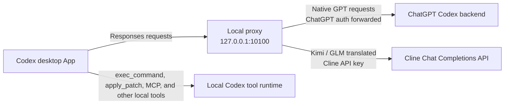

# Cline Codex App Proxy

Use selected Cline Coding Plan models in the native model picker of the macOS Codex desktop App.

The current integration exposes:

- `Cline · Kimi K3`
- `Cline · GLM 5.2`

This project targets the **Codex desktop App**, not Codex CLI. It does not patch the Codex application bundle, alter its code signature, or depend on a visual theme. It runs a loopback proxy, generates a Codex model catalog, and lets the App keep executing its own local tools.

> [!WARNING]
> This is an unofficial community project. It relies on observable Codex App configuration and request behavior that may change in a future App release. It is not affiliated with or endorsed by Cline, OpenAI, Moonshot AI, or Z.ai.

## How it works



The proxy writes a routed model catalog under `~/.codex` and points the App's `openai_base_url` at localhost. Native GPT requests still pass through to the ChatGPT Codex backend. Cline requests are converted to the OpenAI-compatible Chat Completions format and sent to `https://api.cline.bot/api/v1/chat/completions` with the Cline API key.

Tool execution stays inside Codex App. Kimi or GLM can request a tool call, but the App remains responsible for running `exec_command`, code-editing tools, MCP tools, and other local capabilities.

## Compatibility

| Component | Current support |
| --- | --- |
| Host | macOS |
| Client | Codex desktop App |
| Codex authentication | ChatGPT account already signed in through Codex App |
| Cline authentication | Cline API key created at `app.cline.bot` |
| Tested Cline models | Kimi K3 and GLM 5.2 through Cline Coding Plan |
| Verified tool loop | Model requests `exec_command`; Codex App executes it and returns the result |

The integration was last verified on July 20, 2026. Cline can change plan entitlements, model IDs, context limits, or model capabilities independently of this repository.

## Prerequisites

- macOS with Codex desktop App installed
- A ChatGPT account already signed in through Codex App
- Node.js 18 or newer and npm
- A Cline account with access to the desired Coding Plan models
- A Cline API key from **app.cline.bot → Settings → API Keys**

Use a Cline API key intended for programmatic access. Do not extract or reuse the account authentication token managed automatically by the Cline extension or CLI. Cline documents both credential types in its [authentication reference](https://docs.cline.bot/api/authentication).

## Install from source

This fork is not currently published to npm. Install it from the Git repository:

```bash
git clone https://github.com/SergioChan/cline-codex-app-proxy.git
cd cline-codex-app-proxy
npm install
npm run build:gui
npm run install:global
```

Confirm that the installed command is this fork:

```bash
ocx --version
# cline-codex-app-proxy 0.1.0
```

The `ocx` and `opencodex` command aliases are retained for compatibility with the upstream service implementation.

## Configure Cline safely

Run the managed setup command:

```bash
ocx cline setup
```

The command reads the key from a hidden terminal prompt. It deliberately does not accept a key as a command-line value, where it could leak through shell history or process listings.

Automation can provide the key through stdin:

```bash
printf '%s' "$CLINE_API_KEY" | ocx cline setup --api-key-stdin
```

Or through a private file:

```bash
chmod 600 /path/to/cline.key
ocx cline setup --api-key-file /path/to/cline.key
```

Setup only adds `providers.cline`. It preserves every unrelated provider, the current default provider, sub-agent choices, and global proxy preferences. If `providers.cline` already exists and was not created by this setup flow, the command stops. Explicitly adopt it only after reviewing the existing entry:

```bash
ocx cline setup --adopt-existing-cline
```

The setup state records the prior provider and an ownership fingerprint. Removal refuses to overwrite a Cline provider that was edited after setup.

## Start the background service

```bash
ocx service install
ocx sync
ocx status --json
ocx health --json
```

The service binds to `127.0.0.1` by default. Do not expose it on `0.0.0.0` or a LAN address for this use case.

Then fully quit Codex App with **Command-Q** and reopen it. Closing a window is not enough because the running App process can retain its previous model catalog.

Open the model picker and select one of these entries:

| App display name | Codex routed slug | Cline wire model ID |
| --- | --- | --- |
| `Cline · Kimi K3` | `cline/cline-pass-kimi-k3` | `cline-pass/kimi-k3` |
| `Cline · GLM 5.2` | `cline/cline-pass-glm-5.2` | `cline-pass/glm-5.2` |

The display name is metadata only. The proxy sends the unchanged wire model ID expected by Cline.

## Verify the App route

First verify the generated model catalog:

```bash
jq '[.models[] | select(.slug | startswith("cline/")) | {slug, display_name}]' \
  ~/.codex/opencodex-catalog.json
```

Expected display names are `Cline · Kimi K3` and `Cline · GLM 5.2`.

Then create a fresh task in Codex App, select a Cline model, and ask:

```text
Call exec_command to run pwd, then return only the absolute working directory.
```

Seeing a model in the picker proves only that catalog injection worked. A successful tool call proves that the App, proxy, Cline model, and local tool loop completed a real turn.

## Model metadata

The Cline provider is intentionally static (`liveModels: false`). During development, Cline's API did not expose an OpenAI-compatible `/models` response at the configured base URL, so startup discovery would remove or destabilize the two known-good entries.

Current conservative catalog metadata is:

| Model | Context window | App input modalities | Reasoning levels |
| --- | ---: | --- | --- |
| Kimi K3 | 262,144 | text, image | low through max |
| GLM 5.2 | 202,752 | text | low through max |

These values control Codex App catalog behavior; they are not a contractual guarantee from Cline. Check Cline's current [models documentation](https://docs.cline.bot/api/models) when updating them.

## Capabilities and limits

Cline documents an OpenAI-compatible Chat Completions endpoint with streaming and function tool calls. This proxy translates between that interface and the Responses-style stream expected by Codex App.

The result is not identical to using an OpenAI-native Codex model:

- Shell and code-operation tool loops have been verified with Kimi K3 and GLM 5.2.
- Local tools are provided by Codex App, but each model can differ in how reliably it selects and formats tool calls.
- Browser, computer-use, image, MCP, structured-output, compaction, and multi-agent behavior can differ by model and App release.
- Cline reasoning may arrive as `reasoning` or provider-specific encrypted `reasoning_details`. Plain reasoning is translated; encrypted reasoning replay is not guaranteed.
- Effort labels shown by Codex are mapped to the upstream request. They do not guarantee behavior identical to OpenAI's native effort tiers.
- A model that appears in the picker may still be unavailable to the current Cline account or plan.

## Security model

- The Cline API key is stored as plaintext in `~/.opencodex/config.json` with file mode `0600`; `~/.opencodex` is restricted to `0700` on macOS.
- The local proxy necessarily receives the ChatGPT authorization headers sent by Codex App for native GPT passthrough. It does not send those headers to Cline; Cline routes use the configured Cline API key.
- The proxy listens on loopback by default. Do not change the host to a public or LAN interface.
- Never commit `~/.opencodex`, API-key files, screenshots containing credentials, or raw diagnostic logs.
- Revoke a compromised key from **app.cline.bot → Settings → API Keys**.

## Troubleshooting

### The Cline models do not appear

```bash
ocx service status
ocx health --json
ocx sync-cache
ocx sync
```

Then use Command-Q to quit Codex App completely and reopen it. Start a new task; an already-open task can retain its original model state.

### The picker shows `Custom`

Check that the active binary is this fork and that the catalog contains `display_name`:

```bash
ocx --version
jq '.models[] | select(.slug | startswith("cline/")) | {slug, display_name}' \
  ~/.codex/opencodex-catalog.json
```

If the catalog is correct but the App still shows `Custom`, fully quit and reopen the App.

### Codex says the model is unsupported for a ChatGPT account

That message usually means the task reached native ChatGPT model validation instead of the local routed catalog. Confirm the service is healthy, run `ocx sync`, fully restart Codex App, and create a fresh task.

### Cline returns an error

- `401`: the API key is invalid or revoked.
- `402`: the Cline account lacks sufficient plan access or credits.
- `404` or model-unavailable errors: the static model ID may have changed or the account may not be entitled to it.

### Native GPT models also stop working

Native GPT requests pass through the same local service while injection is active. Restart it:

```bash
ocx service start
```

Or temporarily bypass the proxy:

```bash
ocx restore
```

Re-enable routing later with:

```bash
ocx restore back
```

## Remove Cline or uninstall everything

Remove only the managed Cline provider:

```bash
ocx cline remove
ocx sync
```

Then fully quit and reopen Codex App. This preserves every unrelated provider and proxy setting. If the Cline provider changed after setup, removal fails closed instead of deleting the new value.

To stop routing temporarily while preserving proxy state:

```bash
ocx restore
```

To remove the entire proxy, all providers stored under `~/.opencodex`, and its background service:

```bash
ocx uninstall
npm uninstall -g cline-codex-app-proxy
```

Do not manually delete `~/.opencodex` before `ocx uninstall`; restore metadata kept there is needed to put Codex App back on its native configuration.

## Updating

This fork is source-distributed. Update it from the checkout:

```bash
git pull
npm install
npm run build:gui
npm run install:global
ocx service install
ocx sync
```

`ocx update` prints these source-update instructions and does not install the upstream OpenCodex npm package.

## Development

```bash
npm install
npm run typecheck
npm test
npm run privacy:scan
npm run build:gui
npm pack --dry-run
```

The proxy is derived from [OpenCodex](https://github.com/lidge-jun/opencodex). The inherited implementation remains intentionally broad because it provides the Codex App catalog injection, Responses translation, native GPT passthrough, launchd service, recovery journal, and test infrastructure used by this focused integration.

## License and attribution

OpenCodex is licensed under the MIT License. MIT permits use, modification, publication, distribution, sublicensing, and sale, provided the original copyright and license notice remain included.

This repository keeps the upstream [LICENSE](./LICENSE) unchanged and adds [NOTICE.md](./NOTICE.md) with the fork baseline and material modifications. The project can be open sourced under MIT on that basis.

The source-code license does not grant rights to Cline, OpenAI, Moonshot AI, Z.ai, or other third-party services, subscriptions, model weights, APIs, or trademarks. Users remain responsible for the applicable service terms.
