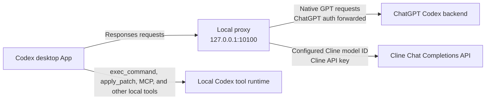

# Cline Codex App Proxy

Route ClinePass models and explicitly configured Cline API model IDs into the native model picker of the macOS Codex desktop App.

The managed setup can add every unique ClinePass model documented for this release, including Kimi, GLM, DeepSeek, MiMo, MiniMax, and Qwen models. It can also accept an exact Cline API `provider/model-name` ID supplied by the user.

This project targets the **Codex desktop App**, not Codex CLI. It does not patch the Codex application bundle, alter its code signature, or depend on a visual theme. It runs a loopback proxy, generates a Codex model catalog, and lets the App keep executing its own local tools.

> [!WARNING]
> This is an unofficial community project. It relies on observable Codex App configuration and request behavior that may change in a future App release. It is not affiliated with or endorsed by Cline, OpenAI, or any model provider.

## How it works



The proxy writes a routed model catalog under `~/.codex` and points the App's `openai_base_url` at localhost. Native GPT requests continue to the ChatGPT Codex backend. Configured Cline routes are translated to OpenAI-compatible Chat Completions requests and sent to `https://api.cline.bot/api/v1/chat/completions` with the Cline API key.

Tool execution stays inside Codex App. A Cline-served model can request a tool call, but the App remains responsible for running `exec_command`, code-editing tools, MCP tools, and other local capabilities.

## Compatibility

| Component | Current status |
| --- | --- |
| Host | macOS |
| Client | Codex desktop App |
| Codex authentication | ChatGPT account already signed in through Codex App |
| Cline authentication | Cline API key created at `app.cline.bot` |
| Configurable ClinePass routes | All unique IDs in the bundled documentation snapshot below |
| Configurable custom routes | User-supplied Cline API IDs in `provider/model-name` form |
| E2E-verified Cline routes | Kimi K3, GLM 5.2, DeepSeek V4 Flash, and MiniMax M3 through ClinePass |
| Verified tool-loop scope | A fresh App task requested `exec_command`, received the local result, and completed |
| Native GPT passthrough check | GPT-5.6 Sol completed the same App tool loop on July 21, 2026 |

The DeepSeek V4 Flash and MiniMax M3 routes were last E2E verified on July 21, 2026; Kimi K3 and GLM 5.2 were last E2E verified on July 20, 2026. Other bundled routes remain configurable but have not completed this project's Codex App E2E check. Cline can change plan entitlements, model IDs, context limits, or model capabilities independently of this repository.

## Route status terminology

- **Configurable** means the route can be written to the local Codex catalog.
- **Documented** means its wire model ID appears in the cited Cline documentation snapshot.
- **Entitled** means the current Cline API key can use it; Cline determines this at request time.
- **E2E verified** means a fresh Codex App task completed through the proxy and the intended Cline route for the stated test scope.

These terms are intentionally not interchangeable. Picker visibility is not proof of account entitlement or model/tool compatibility.

## Prerequisites

- macOS with Codex desktop App installed
- A ChatGPT account already signed in through Codex App
- Node.js 18 or newer and npm
- A Cline API key with access to the model IDs you intend to use
- A ClinePass subscription when using `cline-pass/...` model IDs

Create the API key at **app.cline.bot → Settings → API Keys**. Use a key intended for programmatic access; do not extract or reuse the account authentication token managed automatically by the Cline extension or CLI. Cline documents both credential types in its [authentication reference](https://docs.cline.bot/api/authentication).

## Install from source

This fork is not currently published to npm. Install it from the Git repository:

```bash
git clone https://github.com/SergioChan/cline-codex-app-proxy.git
cd cline-codex-app-proxy
npm install
npm run build:gui
npm run install:global
```

Confirm that the installed command is this fork:

```bash
ocx --version
# cline-codex-app-proxy 0.2.0
```

The `ocx` and `opencodex` aliases are retained for compatibility with the upstream service implementation.

## Configure Cline safely

For a first interactive setup, use the model picker:

```bash
ocx cline setup --configure-models
```

The command first reads the API key from a hidden terminal prompt, then lists the bundled ClinePass snapshot. Enter model numbers or exact IDs separated by commas, enter `all`, enter `default`, or press Enter to keep the current selection. The initial default selection is Kimi K3 plus GLM 5.2.

Inspect the available snapshot and current custom IDs without changing configuration:

```bash
ocx cline models
ocx cline models --json
```

Configure all documented ClinePass models:

```bash
ocx cline setup --all-clinepass-models
```

Configure a smaller explicit set and choose its provider fallback:

```bash
ocx cline setup \
  --model cline-pass/deepseek-v4-flash \
  --model cline-pass/minimax-m3 \
  --default-model cline-pass/minimax-m3
```

`--model` is repeatable and also accepts comma-separated IDs. An exact non-ClinePass Cline API route can be configured the same way:

```bash
ocx cline setup --model deepseek/deepseek-chat
```

Cline documents the general API model format as `provider/model-name`. A custom ID is forwarded unchanged to Cline, but it can require separate pay-as-you-go access or credits and is not automatically covered by ClinePass.

Restore the two-model default selection:

```bash
ocx cline setup --reset-models
```

Re-running setup without a model option rotates or reuses the API key while preserving the managed model list, default model, and metadata.

### Non-interactive key input

The setup deliberately does not accept a key as a command-line value, where it could leak through shell history or process listings. Automation can provide the key through stdin:

```bash
printf '%s' "$CLINE_API_KEY" | ocx cline setup --api-key-stdin \
  --model cline-pass/deepseek-v4-flash \
  --model cline-pass/minimax-m3
```

Or through a private file:

```bash
chmod 600 /path/to/cline.key
ocx cline setup --api-key-file /path/to/cline.key --all-clinepass-models
```

### Configuration ownership

Setup only adds or updates `providers.cline`. It preserves every unrelated provider, the current default provider, sub-agent choices, and global proxy preferences. If `providers.cline` already exists and was not created by this setup flow, the command stops. Explicitly adopt it only after reviewing the existing entry:

```bash
ocx cline setup --adopt-existing-cline --configure-models
```

The setup state records the prior provider and an ownership fingerprint. Removal and repeat setup refuse to overwrite a Cline provider edited outside this managed flow.

## Bundled ClinePass snapshot

The following 11 unique IDs were copied from Cline's [ClinePass documentation](https://docs.cline.bot/getting-started/clinepass) on July 21, 2026. The source page currently repeats Kimi K3 once; the local snapshot deduplicates it.

| App display name | Cline wire model ID |
| --- | --- |
| `Cline · Kimi K3` | `cline-pass/kimi-k3` |
| `Cline · GLM 5.2` | `cline-pass/glm-5.2` |
| `Cline · Kimi K2.7 Code` | `cline-pass/kimi-k2.7-code` |
| `Cline · Kimi K2.6` | `cline-pass/kimi-k2.6` |
| `Cline · DeepSeek V4 Pro` | `cline-pass/deepseek-v4-pro` |
| `Cline · DeepSeek V4 Flash` | `cline-pass/deepseek-v4-flash` |
| `Cline · MiMo V2.5` | `cline-pass/mimo-v2.5` |
| `Cline · MiMo V2.5 Pro` | `cline-pass/mimo-v2.5-pro` |
| `Cline · MiniMax M3` | `cline-pass/minimax-m3` |
| `Cline · Qwen3.7 Max` | `cline-pass/qwen3.7-max` |
| `Cline · Qwen3.7 Plus` | `cline-pass/qwen3.7-plus` |

This is a versioned documentation fallback, not a live entitlement catalog. `ocx cline models` reports the snapshot date so a stale installation is visible.

## Start the background service

```bash
ocx service install
ocx sync
ocx status --json
ocx health --json
```

The service binds to `127.0.0.1` by default. Do not expose it on `0.0.0.0` or a LAN address for this use case.

Then fully quit Codex App with **Command-Q** and reopen it. Closing a window is not enough because the running App process can retain its previous model catalog. Open the model picker and select one of the `Cline · ...` entries you configured.

The App-facing route encodes the inner slash so Codex sees exactly one namespace separator. For example:

| App display name | Codex routed slug | Cline wire model ID |
| --- | --- | --- |
| `Cline · DeepSeek V4 Flash` | `cline/cline-pass-deepseek-v4-flash` | `cline-pass/deepseek-v4-flash` |
| `Cline · MiniMax M3` | `cline/cline-pass-minimax-m3` | `cline-pass/minimax-m3` |

The routed slug is local metadata. The proxy decodes it and sends the unchanged wire ID expected by Cline.

## Verify the App route

First verify the generated model catalog:

```bash
jq '[.models[] | select(.slug | startswith("cline/")) | {slug, display_name}]' \
  ~/.codex/opencodex-catalog.json
```

The output should contain the routes you selected during setup. Their presence proves only that local catalog injection worked.

Then create a fresh task in Codex App, select one configured Cline model, and ask:

```text
Call exec_command to run pwd, then return only the absolute working directory.
```

A successful tool call proves that the App, proxy, selected Cline route, and local tool loop completed that particular turn. Do not treat a successful request on one model as E2E evidence for another configured model.

## Model metadata

The Cline provider is intentionally static (`liveModels: false`). Cline's public API documentation describes model catalog capabilities such as `supportsReasoning` and `supportsImages`, but it does not document a stable authenticated HTTP model-list endpoint or publish those values for every ClinePass entry. Startup discovery is therefore not treated as authoritative.

Kimi K3 and GLM 5.2 retain metadata verified by this project:

| Model | Local context metadata | App input modalities | Codex effort controls |
| --- | ---: | --- | --- |
| Kimi K3 | 262,144 | text, image | low through max |
| GLM 5.2 | 202,752 | text | low through max |

Other snapshot entries and custom IDs receive conservative text-only metadata with no advertised Codex reasoning-effort ladder. Missing context metadata uses the proxy catalog's fallback; it is not a Cline guarantee. These choices avoid inventing capabilities, but they do not prove that a route lacks image or reasoning support.

## Capabilities and limits

Cline documents an OpenAI-compatible [Chat Completions endpoint](https://docs.cline.bot/api/chat-completions) with streaming and function tool calls. This proxy translates between that interface and the Responses-style stream expected by Codex App.

The result is not identical to using an OpenAI-native Codex model:

- The Codex App → proxy → Cline → local-tool loop has been E2E verified only for the routes listed as verified above.
- Local tools are provided by Codex App, but each model can differ in how reliably it selects and formats tool calls.
- Browser, computer-use, image, MCP, structured-output, compaction, and multi-agent behavior can differ by model and App release.
- Cline reasoning may arrive as `reasoning` or provider-specific encrypted `reasoning_details`. Plain reasoning is translated; encrypted reasoning replay is not guaranteed.
- Effort labels shown by Codex are mapped to the upstream request only for models with configured effort metadata. They do not guarantee behavior identical to OpenAI's native effort tiers.
- A model that appears in the picker may still be unavailable to the current Cline account or plan.

## Security model

- The Cline API key is stored as plaintext in `~/.opencodex/config.json` with file mode `0600`; `~/.opencodex` is restricted to `0700` on macOS.
- The local proxy necessarily receives the ChatGPT authorization headers sent by Codex App for native GPT passthrough. It does not send those headers to Cline; Cline routes use the configured Cline API key.
- The proxy listens on loopback by default. Do not change the host to a public or LAN interface.
- Never commit `~/.opencodex`, API-key files, screenshots containing credentials, or raw diagnostic logs.
- Revoke a compromised key from **app.cline.bot → Settings → API Keys**.

## Troubleshooting

### Configured Cline routes do not appear

```bash
ocx cline status --json
ocx service status
ocx health --json
ocx sync-cache
ocx sync
```

Then use Command-Q to quit Codex App completely and reopen it. Start a new task; an already-open task can retain its original model state.

### The picker shows `Custom`

Check that the active binary is this fork and that the catalog contains `display_name`:

```bash
ocx --version
jq '.models[] | select(.slug | startswith("cline/")) | {slug, display_name}' \
  ~/.codex/opencodex-catalog.json
```

If the catalog is correct but the App still shows `Custom`, fully quit and reopen the App.

### Codex says the model is unsupported for a ChatGPT account

That message usually means the task reached native ChatGPT model validation instead of the local routed catalog. Confirm the service is healthy, run `ocx sync`, fully restart Codex App, and create a fresh task.

### Cline returns an error

- `401`: the API key is invalid or revoked.
- `402`: the Cline account lacks sufficient plan access or credits.
- `404` or model-unavailable: confirm the exact configured wire ID, current Cline entitlement, and whether the model remains documented by Cline. The local snapshot is not a live entitlement check.

### Native GPT models also stop working

Native GPT requests pass through the same local service while injection is active. Restart it:

```bash
ocx service start
```

Or temporarily bypass the proxy:

```bash
ocx restore
```

Re-enable routing later with:

```bash
ocx restore back
```

## Remove Cline or uninstall everything

Remove only the managed Cline provider:

```bash
ocx cline remove
ocx sync
```

Then fully quit and reopen Codex App. This preserves every unrelated provider and proxy setting. If the Cline provider changed after setup, removal fails closed instead of deleting the new value.

To stop routing temporarily while preserving proxy state:

```bash
ocx restore
```

To remove the entire proxy, all providers stored under `~/.opencodex`, and its background service:

```bash
ocx uninstall
npm uninstall -g cline-codex-app-proxy
```

Do not manually delete `~/.opencodex` before `ocx uninstall`; restore metadata kept there is needed to put Codex App back on its native configuration.

## Updating

This fork is source-distributed. Update it from the checkout:

```bash
git pull
npm install
npm run build:gui
npm run install:global
ocx service install
ocx sync
```

`ocx update` prints these source-update instructions and does not install the upstream OpenCodex npm package. After updating, compare the bundled snapshot date from `ocx cline models` with the current ClinePass documentation.

## Development

```bash
npm install
npm run typecheck
npm test
npm run privacy:scan
npm run build:gui
npm pack --dry-run
```

The proxy is derived from [OpenCodex](https://github.com/lidge-jun/opencodex). The inherited implementation remains intentionally broad because it provides the Codex App catalog injection, Responses translation, native GPT passthrough, launchd service, recovery journal, and test infrastructure used by this focused integration.

## License and attribution

OpenCodex is licensed under the MIT License. MIT permits use, modification, publication, distribution, sublicensing, and sale, provided the original copyright and license notice remain included.

This repository keeps the upstream [LICENSE](./LICENSE) unchanged and adds [NOTICE.md](./NOTICE.md) with the fork baseline and material modifications. The project can be open sourced under MIT on that basis.

The source-code license does not grant rights to Cline, OpenAI, or other third-party services, subscriptions, model weights, APIs, or trademarks. Users remain responsible for the applicable service terms.
